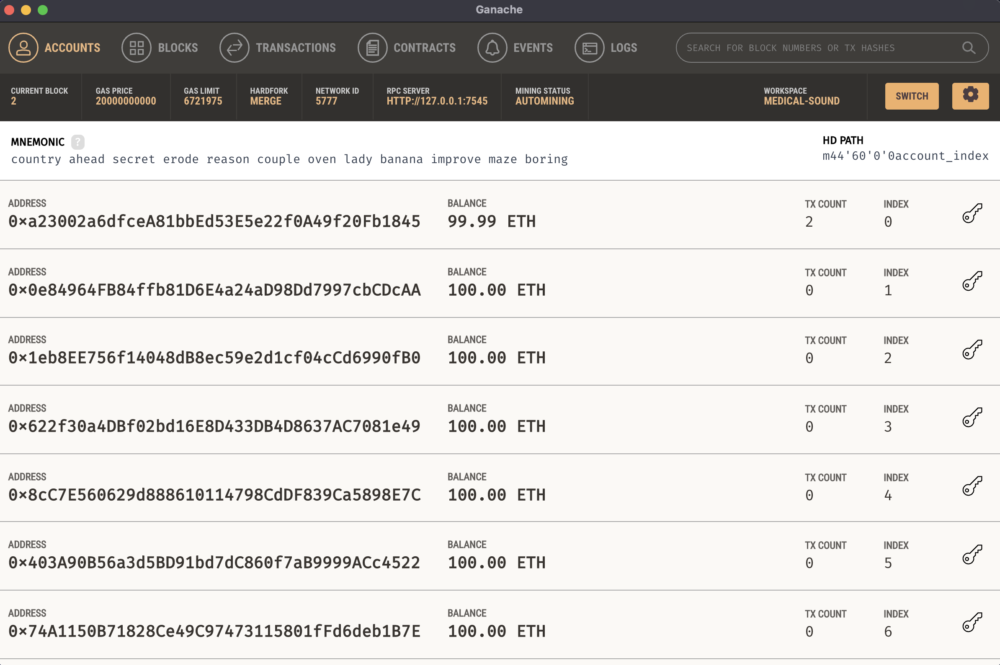
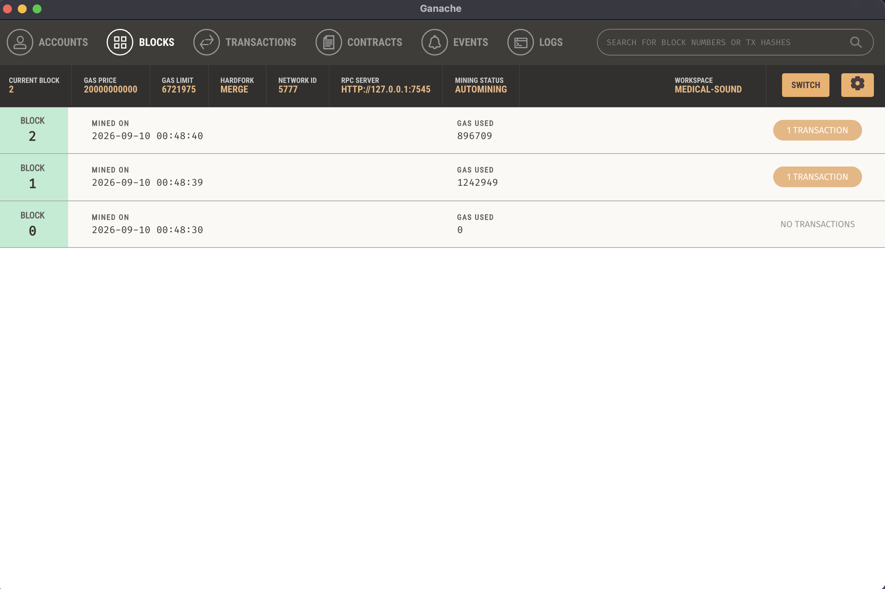
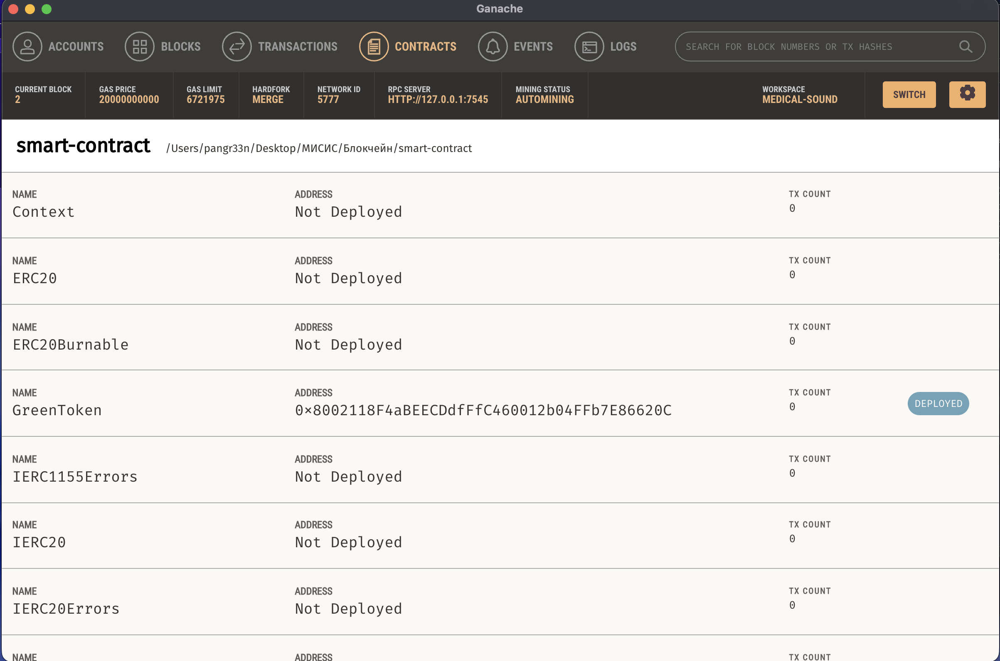
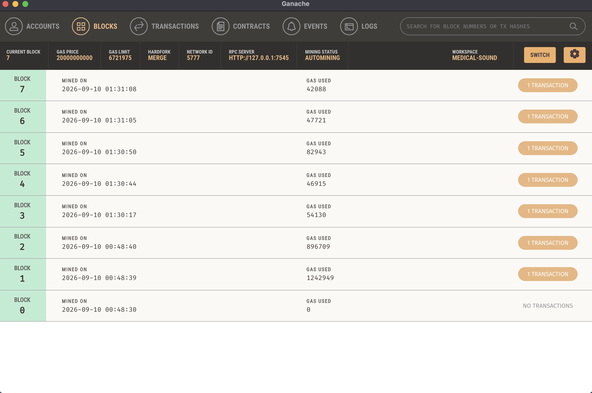
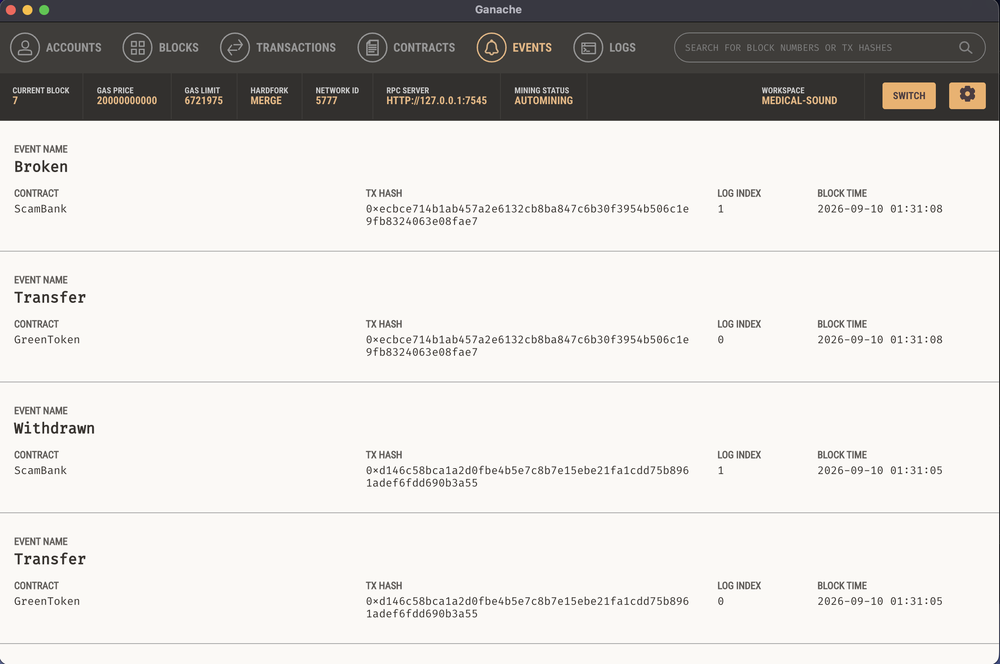

## Описание прокта
**GreenToken** - токен на основе @openzeppelin (ERC20)
+ GreenToken / GRN
+ GreenToken — "зелёная" валюта проекта. Идея: 1 токен = условная единица вклада в экологическую активность (например, посаженное дерево / переработанный мусор). Токен неделим (decimals = 0) специально — целые действия не имеет смысла дробить.
+ Токен неделимый, минимальная единица — 1 целый GRN
+ Эмиссия контролируемая — новые токены может выпускать только owner через mint(address to, uint256 amount)
+ transfer, approve, transferFrom... реализованы наследованием от @openzeppelin/contracts/token/ERC20/ERC20.sol

| Функция | Кто может вызвать | Что делает |
|---|---|---|
| transfer, approve, transferFrom... | - | Стандартное поведение ERC20-токена, без дополнительной логики |
| mint(address to, uint256 amount) | owner | Выпуск новых токенов |

--- 


**ScamBank** - кнтракт-хранилище, аналог копилки, принимает GreenToken
+ **Осознанный rug pull**. Owner контракта имеет право забрать весь баланс контракта одним вызовом (breakBank).

Логика работы:
1. Привязывается к конкретному токену при деплое через адрес в конструкторе (IERC20)
2. Пользователь сначала вызывает token.approve(scamBankAddress, amount) — разрешает контракту тратить токены
3. deposit(amount) — контракт забирает токены через transferFrom и записывает баланс пользователя во внутренний mapping
4. withdraw(amount) — пользователь возвращает свою часть обратно
5. breakBank() — доступен только для owner, забирает весь баланс контракта
---

## Состав проекта
+ `contracts/GreenToken.sol` — ERC-20 токен
+ `contracts/ScamBank.sol` - контракт-хранилище, принимающий и хранящий GreenToken
+ `migrations/1_deploy_contracts.js` — скрипт деплоя
+ Локальная сеть — Ganache

## Деплой
```bash
npm install
truffle compile
truffle migrate --network development --reset 
```

### Состояние сети после деплоя





## Проверка через truffle console
```bash
truffle console
```

```javascript
let token = await GreenToken.deployed()
let bank = await ScamBank.deployed()

await token.mint(accounts[1], 500, { from: accounts[0] })

// Разрешить банку тратить токены
await token.approve(bank.address, 100)

// Депозит
await bank.deposit(100)

// Проверить баланс банка
await token.balanceOf(bank.address)

// Вывести свою часть
await bank.withdraw(50)

// owner может забрать всё
await bank.breakBank()
```

### Состояние сети после вызова контракт


